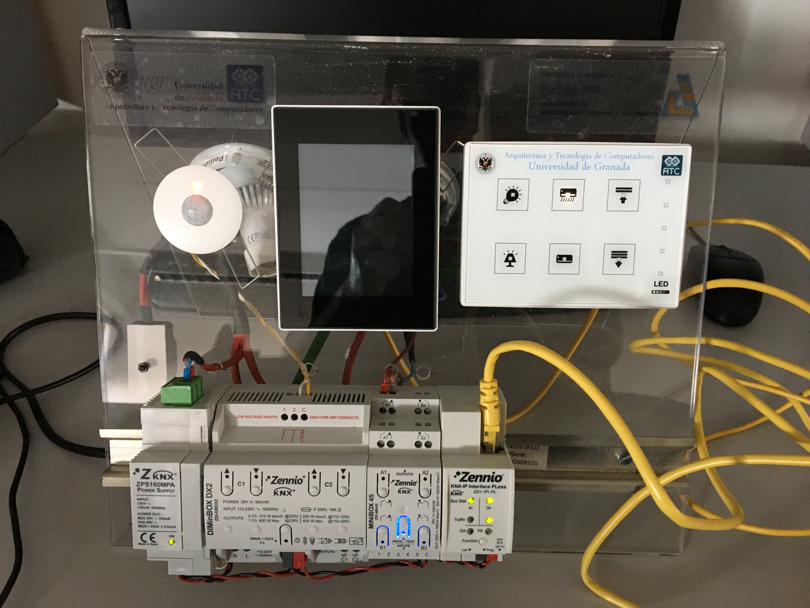

# DOM

Repositorio para las prácticas de la asignatura Domótica impartida en el master profesional en ingeniería informática de la Universidad de Granada. 

En estas prácticas se llevará a cabo la implementación mediante distintos sistemas del estándar KNX los siguientes automatismos:

- Control de iluminación. 
- Control de iluminación por regulación. 
- Control de presencia (control de luz durante la noche por detección de movimiento).
- Control de temperatura (termostato con Touch-MyDesign o con Z41).
- Control de persianas (con mininbox 45).
- Uso de un panel táctil Z41 (establecimiento de temperatura de consigna para el termostato).

El sistema sobre el que se han realizado las prácticas es el siguiente. 

	
